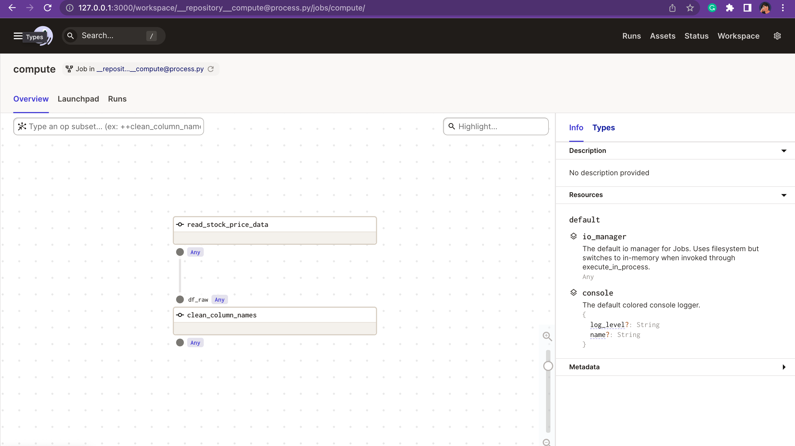
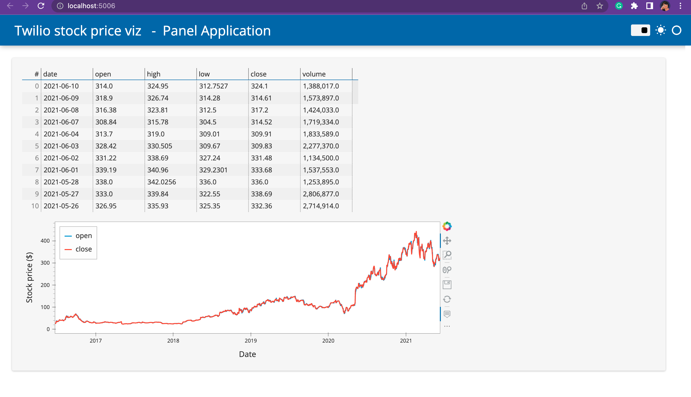
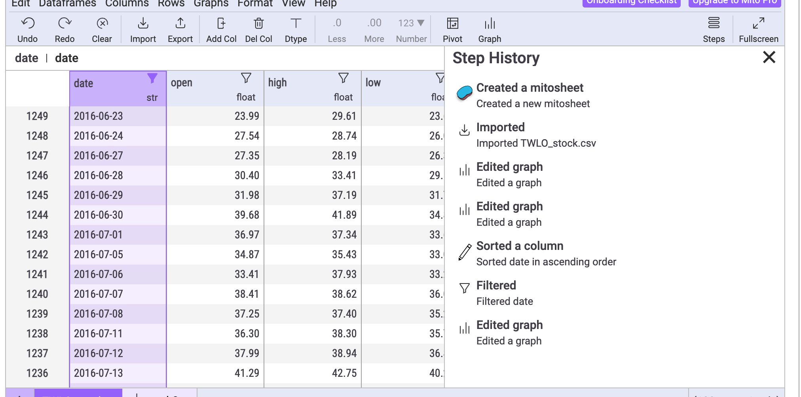

### 🚌 DataJourney
Tutorial featuring Data engineering workflow and Open Source tools and technologies.
The example datasets are openly available online, metadata info is present in the `intake` catalog

### 🛠 Current workflows covered (✨ represents: experimental)
✅ Packaging framework added
✅ Conda environment added
✅ GitHub actions configured
✅ Pre-commit hooks configured for code linting/formating
✅ Reading data from online sources using [intake](https://github.com/intake/intake)
✅ Sample pipeline built using [Dagster](https://github.com/dagster-io/dagster)
✅ Building Dashboard using [holoviews](https://holoviews.org/gallery/index.html) + [panel](https://panel.holoviz.org/reference/index.html)
✨ Exploratory data analysis (EDA) using [mito](https://www.trymito.io/)

#### Codespaces configured


### Environment setup using conda:

#### Installing miniconda
- Visit : https://docs.conda.io/en/latest/miniconda.html

#### Create a conda environment
```shell
conda env create -f environment.yml
```
```shell
conda activate journey
```

#### Install the package locally
```shell
pip install -e .
```

#### 🔌 About pre-commit-hooks and activating
Just like the name suggests, pre-commit-hooks are designed to format the code based on PEP standards before committing. [More details 🗒](https://pre-commit.com/)

```shell
pre-commit install
```
#### How to run the applications?

- Dagster UI app
```shell
cd analytics_framework/pipeline
```
```shell
dagit -f process.py
```


- Panel app
```shell
cd analytics_framework/dashboard
```
```shell
python simple_app.py
```


- Mito

Before running the jupyter notebook `doc/mito_exp.ipynb`, run the below command
in your terminal to enable the installer. Might take some time to run.

To explore further visit [trymito.io](https://docs.trymito.io/)
```shell
python -m mitoinstaller install
```
 
