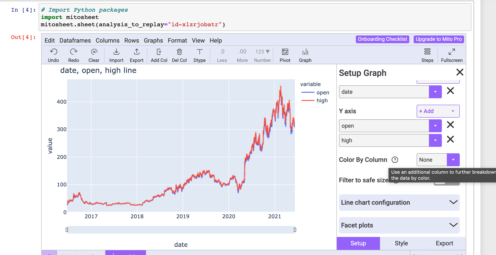
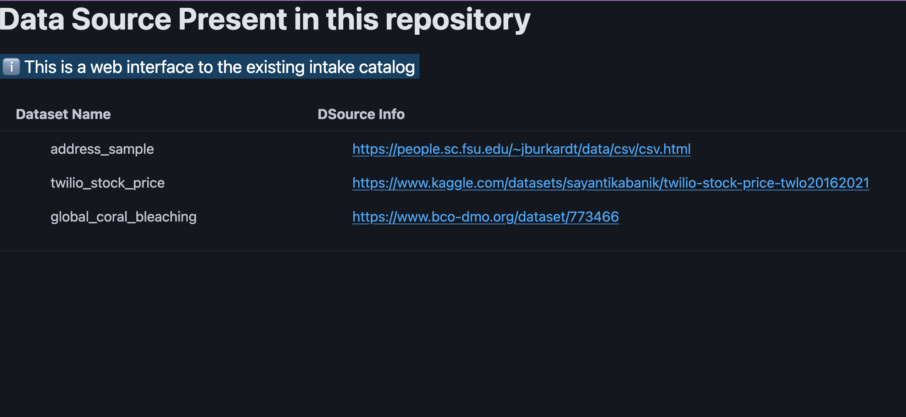

<h1 align="center">

[](https://creativecommons.org/publicdomain/zero/1.0/)
[](https://www.contributor-covenant.org/version/2/0/code_of_conduct/)\
[](https://github.com/sayantikabanik/DataJourney/actions/workflows/CI.yml)
[](https://github.com/sayantikabanik/DataJourney/actions/workflows/github-repo-stats.yml)
[](https://github.com/sayantikabanik/DataJourney/actions/workflows/static.yml)
[](https://github.com/sayantikabanik/DataJourney/actions/workflows/review.yml)

</h1>

<p align="center">
  
</p>


### 🚌 What's DataJourney?
DataJourney demonstrates how organizations can effectively manage and utilize data by harnessing the power of open-source technologies. It's designed to help navigate the complex landscape of data tools, offering a structured approach to building **scalable**, and **reproducible** data workflows.

Built on open-source principles, the framework guides users through essential steps—from **identifying** goals and **selecting tools** to **testing** and **customising** workflows. With its flexible, modular design, DataJourney can be tailored to individual needs, making it an invaluable toolkit for data professionals.

### 🧱 🧱Design Philosophy
A mesh with additive, subtractive capabilities glued with open source.\
{More...coming soon}


### 🛠 Current workflows covered
{✨= Experimental,
✅ = Implemented}

✅ `Python Packaging framework` design principles\
✅ `GitHub actions` configured\
✅ `Vale.sh` configured at PR level\
✅ `Pre-commit hooks` configured for code linting/formatting\
✅ Environment management via [pixi](https://prefix.dev/)\
✅ Reading data from online sources using [intake](https://github.com/intake/intake)\
✅ Sample pipeline built using [Dagster](https://github.com/dagster-io/dagster)\
✅ Building Dashboard using [holoviews](https://holoviews.org/gallery/index.html) + [panel](https://panel.holoviz.org/reference/index.html)\
✅ Exploratory data analysis (EDA) using [mito](https://www.trymito.io/)\
✅ Web UI build on [Flask](https://flask.palletsprojects.com/en/3.0.x/) \
✅ Web UI re-done and expanded with [FastHTML](https://docs.fastht.ml/)\
✅ Leverage AI models to analyse data [GitHub AI models Beta](https://docs.github.com/en/github-models/prototyping-with-ai-models)

### 📊 Repository stats

⚙️ Managed by GitHub Action: https://github.com/jgehrcke/github-repo-stats \
⏳ Configured to run daily at 23:55:00 IST\
📬 Checkout daily reports generated: [DataJourney Stats on Web](https://sayantikabanik.github.io/DataJourney/)

### Dataset metadata/citations

- Global coral bleaching dataset: [Additional Info](https://www.bco-dmo.org/dataset/773466)
```txt
van Woesik, R., Burkepile, D. (2022) Bleaching and environmental data for global coral reef sites from 1980-2020. Biological and Chemical Oceanography Data Management Office (BCO-DMO). (Version 2) Version Date 2022-10-14 [if applicable, indicate subset used]. doi:10.26008/1912/bco-dmo.773466.2 [access date]
Terms of Use
This dataset is licensed under Creative Commons Attribution 4.0 (https://creativecommons.org/licenses/by/4.0/)
```

### Environment setup using pixi:

#### Installing pixi & getting started
- Download pixi : [prefix.dev](https://prefix.dev/)
- Activate env: `pixi shell`
- List all the tasks: `pixi task list`
- Execute a task from the list: `pixi run <TASK>`
- Execute a task with verbosity enabled: `pixi run -v <TASK>`

# current tasks present under DJ

- GIT_TOKEN_CHECK
- DJ_package
- DJ_pre_commit
- DJ_dagster
- DJ_fasthtml_app
- DJ_flask_app
- DJ_mito_app
- DJ_panel_app
- DJ_ai_models

#### Install the package locally
```shell
pixi run DJ_package
```

#### 🔌 About pre-commit-hooks and activating
Just like the name suggests, pre-commit-hooks are designed to format the code based on PEP standards before committing. [More details](https://pre-commit.com/)

```shell
pixi run DJ_pre_commit
```
### Commands to run modules under DataJourney

#### Dagster UI

```shell
pixi run DJ_dagster
```


#### Panel app
```shell
pixi run DJ_panel_app
```

*NOTE:*
The dashboard generated is exported into HTML format and saved as [stock_price_twilio_dashboard](analytics_framework%2Fdashboard%2Fstock_price_twilio_dashboard.html)


#### Mito

To explore further visit [trymito.io](https://docs.trymito.io/)
```shell
pixi run DJ_mito_app
```

[//]: # (![mito output]&#40;assets/pipeline/mito_graph.png "Graph generated via mitosheet"&#41; ![mito output operation]&#40;assets/pipeline/mito_operations.png "Operations performed via mitosheet"&#41;)

<div style="display: flex; justify-content: space-between;">
    
    
</div>

#### Display all data sources present via web UI

```shell
# Run FastHTML app
pixi run DJ_fasthtml_app
```


#### Executing LLM script to analyse data

```shell
pixi run DJ_ai_models
```
